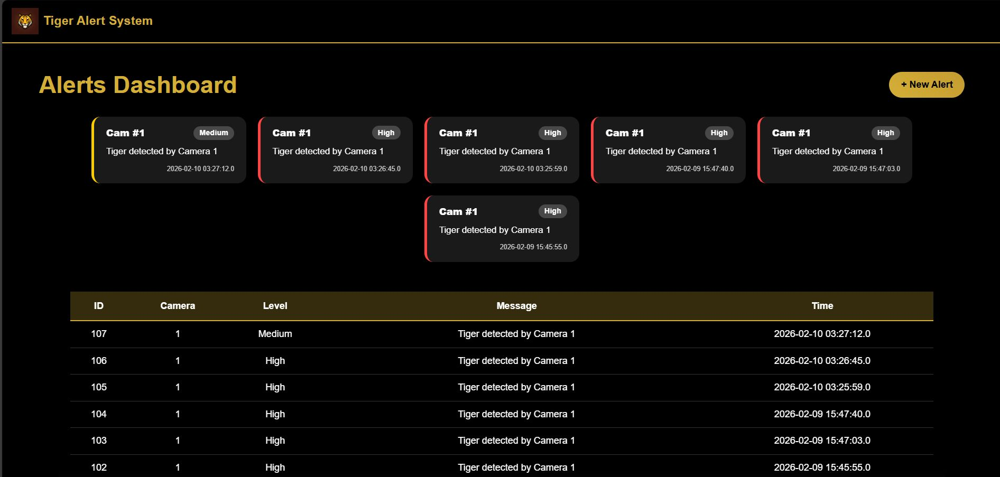
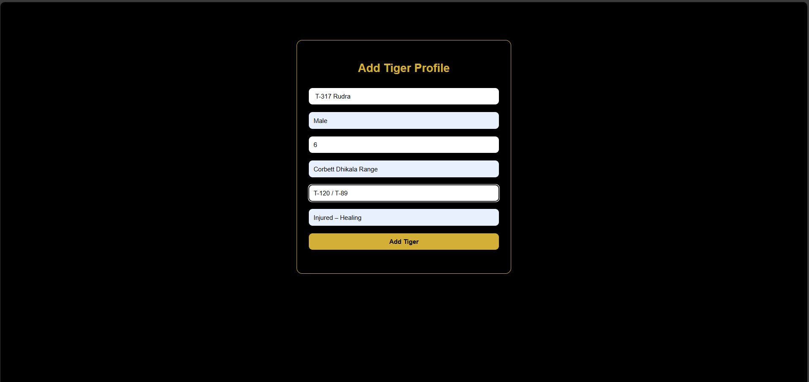
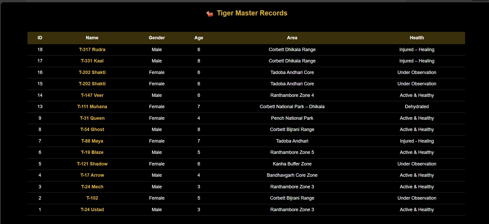
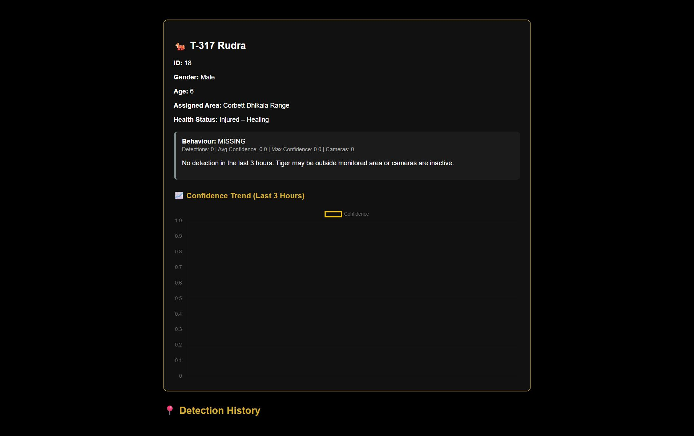
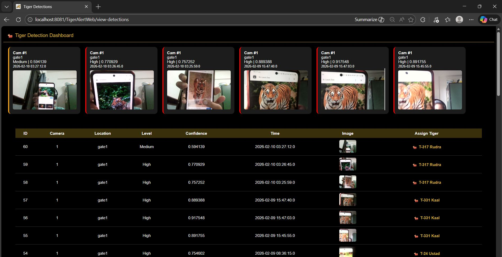
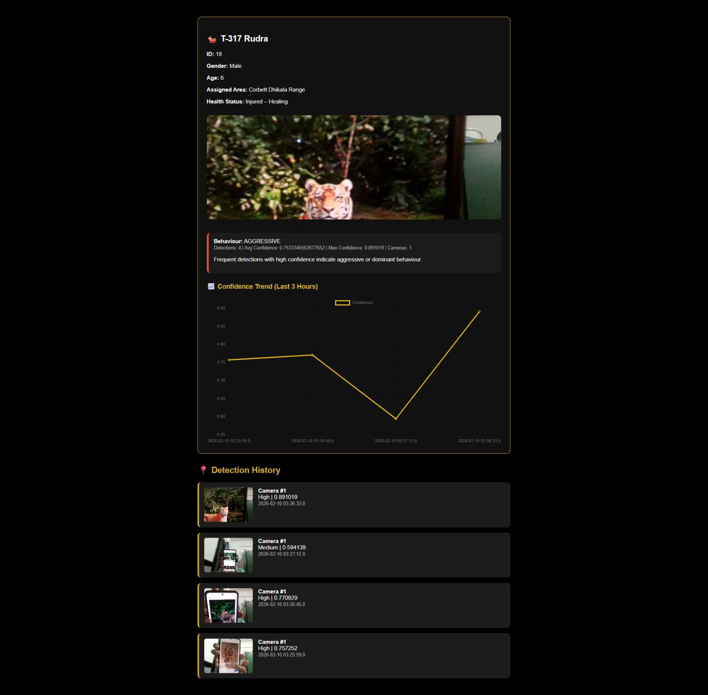

# 🐯 Tiger Alert System

Keep track of tigers in wildlife reserves with real-time alerts and AI-powered detection. Know where they are, what they're doing, and stay updated with instant notifications.

## What It Does

- **See Real-Time Alerts** - Get instant notifications when cameras detect tigers
- **Keep Tiger Records** - Manage info about each tiger (name, age, where they live, health status)
- **Track Individual Tigers** - See where each tiger goes, how healthy they are, and their activity patterns with confidence trends
- **Smart Detection** - AI automatically spots tigers in camera footage, tracks them, and shows confidence scores
- **Manage Cameras** - Add camera locations and monitor what they catch in real-time
- **Create Alerts** - Set up alerts for important tiger detections and track them over time
- **Track Missing Tigers** - Get alerts for tigers that haven't been detected in a while
- **Monitor Health** - Track tiger health status (Healthy, Injured, Missing, Aggressive)

## How It's Built

**Languages & Tools:**
- Java for the backend (web server)
- JSP and HTML for the website interface
- Python for AI detection
- Apache Ant for building the project

**Where Everything Is:**
- `src/java/` - Backend code and database stuff
- `web/` - Website pages and styling
- `TigerAI/` - AI detection scripts
- `TigerAlertStorage/` - Storage for detected images

## Getting Started

**What You Need:**
- Java (version 8 or later)
- Apache Tomcat (the server that runs the app)
- Python 3.7 or later
- A database (MySQL or similar)

**Setup Steps:**

1. Build the project:
   ```bash
   ant build
   ```

2. Copy the built app to Tomcat and start it:
   - The app will be ready at: `http://localhost:8080/TigerAlertWeb`

3. Set up your database:
   - Update the database settings in the config files
   - Run any database setup scripts

4. Install Python dependencies:
   ```bash
   cd TigerAI
   pip install -r requirements.txt
   ```

Done! Open your browser and start using it.

## Main Pages

**Alerts Dashboard** - See all the tiger alerts in one place. Shows camera detections with severity levels (medium or high).

**Tiger Records** - A list of all the tigers you're tracking. Shows their name, age, gender, where they live, and if they're healthy.

**Tiger Profile** - Details about one specific tiger. Check when it was last seen, where, and what it's been up to. Shows confidence trend graphs to track detection patterns.

**Detection Dashboard** - Recent camera detections shown as a grid with thumbnails. You can assign detected tigers to tiger profiles here and see the confidence scores.

**Camera Management** - Add new cameras and see what each one is catching. Track alerts per camera and monitor camera feeds in real-time.

**Add Tiger** - Create new tiger records with detailed information (name, age, gender, health status, habitat assignment).

**Track Missing Tigers** - Auto-missing tiger feature that helps identify and track tigers that haven't been detected in a while.

**Health & Behavioral Status** - Monitor tiger health conditions:
  - Active & Healthy
  - Injured - Healing
  - Missing
  - Aggressive

## Screenshots & Features in Action

Here's a visual tour of the application:

1. **Alerts Dashboard** - Real-time tiger detection alerts from camera feeds
   

2. **Tiger Master Records** - Complete tiger database with all records
   

3. **Tiger Profile & Detection History** - Individual tiger details with confidence trends
   

4. **Detection Dashboard** - Camera detections grid with thumbnails and confidence scores
   

5. **Camera Management** - Monitor camera locations and feed activity
   

6. **Add & Manage Tigers** - Create new tiger records with full details
   

## AI Detection

The Python scripts automatically spot tigers in camera footage:
- Looks at camera feeds and identifies tigers
- Gives a confidence score (how sure it is)
- Learns to recognize individual tigers

Run detection like this:
```bash
python TigerAI/detect_tiger.py --input <camera_feed> --output <results>
```

## Data & Storage

- **Alerts** - Saved with date, camera ID, and severity level
- **Tiger Records** - All info about each tiger (health, location, etc.)
- **Detections** - Timestamped camera detections with confidence scores

## Look & Feel

Dark theme with gold accents. Simple cards for alerts, sortable tables for records, and graphs showing tiger activity trends.

## Security

- Login required to access the system
- Different permission levels for different users
- Secure database connections

## Common Problems

**Can't connect to database?**
- Check your database settings and make sure the server is running

**Python errors?**
- Install missing packages: `pip install -r requirements.txt`

**App won't start?**
- Check the Tomcat logs for errors

**Camera feed issues?**
- Make sure cameras are set up correctly and can connect to the network

## Questions or Issues?

Check the docs or contact the team if you run into problems.

## Why This Matters 🐯

This system helps protect tigers by:
- Real-time monitoring in wildlife reserves
- Quick spotting of tiger movements
- Health tracking for better conservation
- Smart data for better management decisions
- Supporting wildlife protection efforts

---

**Tiger Alert System** - Technology for tiger conservation 🐯
